# 

# Food Price Inflation Analysis

## Team Members

This project was developed as part of a Code Institute Hackathon by:

| Name | Role |
|------|------|
| **Florence** | Hypothesis Testing, Documentation & Power BI |
| **Gia** | Streamlit Dashboard, Hypothesis Testing & Project Board |
| **Sergio** | Streamlit Dashboard, Machine Learning & Hypothesis Testing |

---

## Project Overview

This project analyses global food price inflation trends using the World Real-Time Food Prices (RTFP) dataset. The analysis aims to understand how food prices have evolved across different countries over time, identify patterns in inflation, and provide actionable insights for stakeholders.

### Business Problem

Food price inflation significantly impacts economies and household budgets worldwide. Understanding these trends helps policymakers, businesses, and consumers make informed decisions. This project addresses:
- How have food prices changed across different regions?
- What are the key drivers of food price inflation?
- Can we identify patterns or predict future trends?

---

## Table of Contents

1. [Dataset Information](#dataset-information)
2. [Project Objectives](#project-objectives)
3. [Methodology](#methodology)
4. [Project Structure](#project-structure)
5. [ETL Pipeline](#etl-pipeline)
6. [Data Analysis](#data-analysis)
7. [Visualisations](#visualisations)
8. [Key Findings](#key-findings)
9. [Ethical Considerations](#ethical-considerations)
10. [Installation & Setup](#installation--setup)
11. [Technologies Used](#technologies-used)
12. [Future Improvements](#future-improvements)
13. [Credits & References](#credits--references)

---

## Dataset Information

**Source**: World Bank - Real-Time Food Prices (RTFP)  
**File**: `data/raw/WLD_RTFP_country_2023-10-02.csv`  
**Time Period**: January 2007 - October 2023  
**Records**: 4,798 observations  

### Variables

| Variable | Description | Type |
|----------|-------------|------|
| Open | Opening price index for the month | Float |
| High | Highest price index for the month | Float |
| Low | Lowest price index for the month | Float |
| Close | Closing price index for the month | Float |
| Inflation | Year-over-year inflation rate (%) | Float |
| country | Country name | String |
| ISO3 | ISO 3166-1 alpha-3 country code | String |
| date | Date of observation (monthly) | Date |

---

## Project Objectives

### Primary Objectives
1. **Analyse global food price trends** across multiple countries and time periods
2. **Identify inflation patterns** and their correlation with price movements
3. **Develop statistical insights** to understand price volatility
4. **Create visualisations** that communicate findings to diverse audiences

### Learning Outcomes Addressed
- LO1: Apply core principles of statistics and probability
- LO2: Demonstrate practical data manipulation skills with Python
- LO3: Analyse real-world problems using data analytics
- LO4: Utilise Jupyter Notebooks enhanced by AI assistance
- LO5: Implement effective data management practices
- LO6: Address ethical considerations in data analytics
- LO7: Design independent research methodology
- LO8: Communicate complex insights effectively
- LO9: Apply data analytics across domains
- LO10: Plan and evaluate data analytics projects
- LO11: Adapt to new tools and methodologies

---

## Methodology

### Research Approach
This project follows the **CRISP-DM (Cross-Industry Standard Process for Data Mining)** methodology:

1. **Business Understanding**: Define the problem and objectives
2. **Data Understanding**: Explore and assess the dataset
3. **Data Preparation**: Clean, transform, and prepare data
4. **Modeling**: Apply statistical analysis and hypothesis testing
5. **Evaluation**: Assess results and validate findings
6. **Deployment**: Create visualisations and documentation

### Hypothesis Testing

**H1**: Food price inflation varies significantly across different regions

**H2**: Price volatility (High-Low range) correlates with inflation rates

**H3**: There are seasonal patterns in food price movements

**H4**: Food prices have increased significantly over time (2007-2023)

**H5**: Machine learning models can reasonably forecast short-term inflation trends

---

## Project Structure

```
Food_price_inflation_analysis/
│
├── data/
│   ├── raw/                                        # Original, immutable data
│   │   └── WLD_RTFP_country_2023-10-02.csv
│   └── cleaned/                                    # Processed, analysis-ready data
│       └── food_prices_cleaned.csv
│
├── jupyter_notebooks/
│   ├── Data_Cleaning.ipynb                         # ETL pipeline & data preprocessing
│   ├── Data_Analysis.ipynb                         # EDA & statistical analysis
│   ├── Hypothesis_Testing.ipynb                    # H1–H5 statistical tests
│   └── ML_Predictions.ipynb                        # Model training, evaluation & export
│
├── outputs/
│   ├── figures/                                    # Charts generated by notebooks
│   │   ├── actual_vs_predicted.png
│   │   ├── correlation_matrix.png
│   │   ├── country_comparison.png
│   │   ├── distribution_analysis.png
│   │   ├── feature_importance.png
│   │   ├── h1_regional_inflation.png
│   │   ├── h2_volatility_inflation.png
│   │   ├── h3_seasonal_inflation.png
│   │   ├── h4_price_trend.png
│   │   ├── h5_arima_forecast.png
│   │   ├── ml_model_comparison.png
│   │   ├── seasonal_analysis.png
│   │   └── time_series_analysis.png
│   ├── models/                                     # Serialised ML model artefacts
│   │   ├── best_model.joblib
│   │   ├── country_encoder.joblib
│   │   ├── feature_columns.joblib
│   │   └── feature_scaler.joblib
│   └── reports/                                    # Summary CSVs from analysis
│       ├── hypothesis_test_results.csv
│       └── ml_model_comparison.csv
│
├── Power Bi/
│   └── Food Price Inflation Analysis.pbix          # Power BI interactive report
│
├── app.py                                          # Streamlit web dashboard (8 pages)
├── .gitignore
├── .python-version
├── .slugignore
├── Procfile                                        # Heroku deployment config
├── README.md
├── requirements.txt
└── setup.sh
```

---

## ETL Pipeline

### Extract
- Loaded raw CSV data from World Bank RTFP dataset
- Verified data integrity and structure

### Transform
- Converted date columns to datetime format
- Handled missing values in inflation column (364 records with NaN)
- Renamed columns to snake_case for consistency
- Created derived features:
  - `price_range`: High - Low (volatility indicator)
  - `price_change`: Close - Open
  - `price_change_pct`: Percentage change within period
  - `year`, `month`, `quarter`: Temporal decomposition

### Load
- Saved cleaned data to `data/cleaned/food_prices_cleaned.csv`
- Maintained data lineage documentation

### Validation Checks
- ✅ No negative prices detected
- ✅ High >= Low consistency verified
- ✅ No duplicate records found
- ✅ Date range: 2007-01-01 to 2023-10-01

---

## Data Analysis

### Statistical Summary

| Metric | Description |
|--------|-------------|
| Countries | 25 unique countries analysed |
| Time Span | 16+ years of monthly data |
| Inflation Range | -31.37% to 96.79% |

### Key Analyses Performed
1. **Descriptive Statistics**: Central tendency, dispersion measures
2. **Time Series Analysis**: Trend identification, seasonality
3. **Correlation Analysis**: Price-inflation relationships
4. **Comparative Analysis**: Cross-country comparisons

#### Sample Visualisations from the Analysis

<p align="center">
  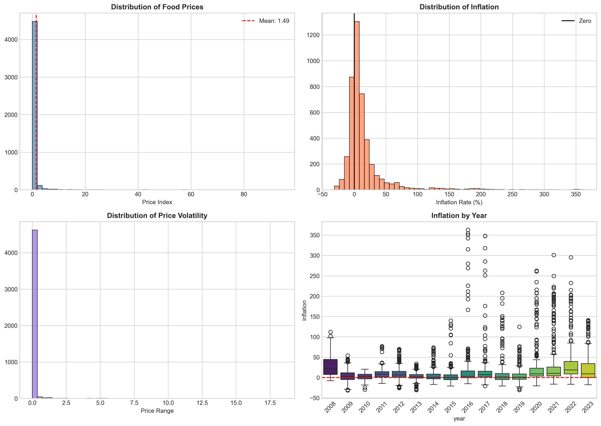
  <br><em>Distribution of key price and inflation variables</em>
</p>

<p align="center">
  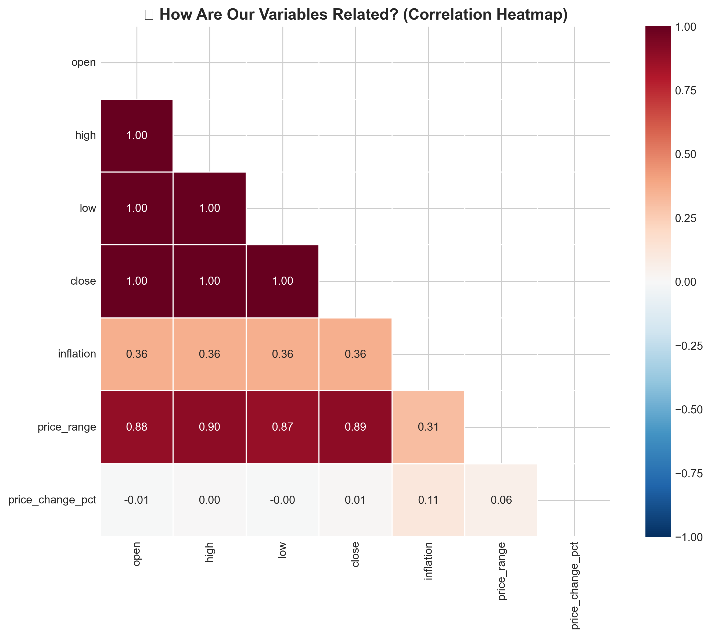
  <br><em>Correlation heatmap showing relationships between price indicators and inflation</em>
</p>

<p align="center">
  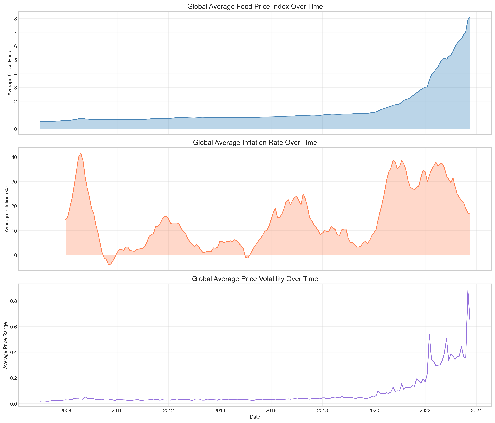
  <br><em>Food price trends over time (2007–2023)</em>
</p>

<p align="center">
  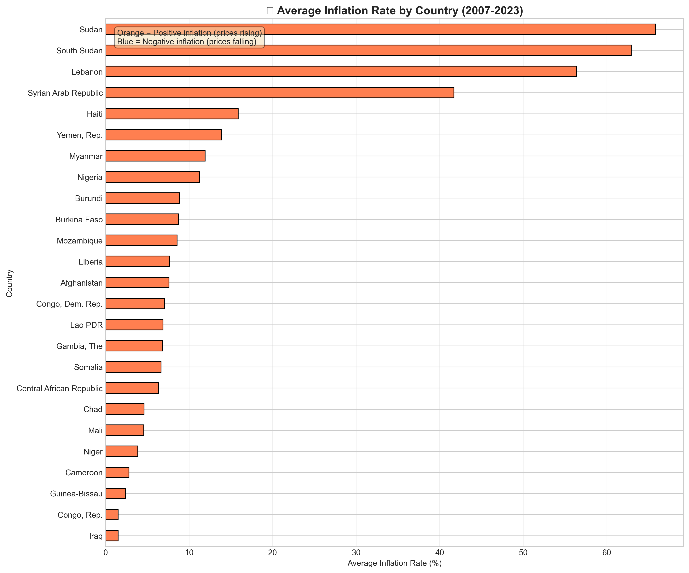
  <br><em>Comparative food price inflation across countries</em>
</p>

<p align="center">
  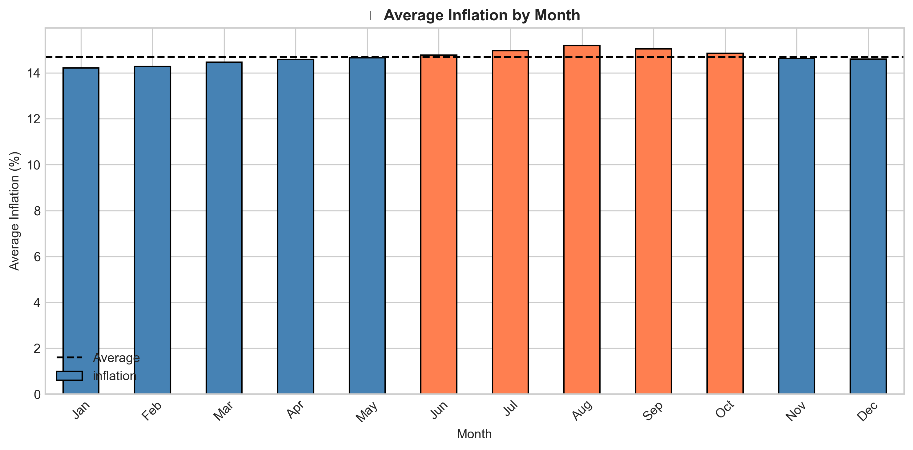
  <br><em>Seasonal patterns in food price movements</em>
</p>

---

## Visualisations

This project delivers **two complementary dashboards** built for different audiences:

### 🖥️ Streamlit Web Dashboard (`app.py`)
An interactive Python-powered web app with 8 pages, deployed via Heroku.

| Page | Description |
|------|-------------|
| Overview | Key metrics, price trend chart, quick actions |
| Data Cleaning | ETL process walkthrough with code snippets |
| Data Analysis | Distribution, correlation heatmap, seasonal & country charts |
| Hypothesis Testing | Live H1–H5 statistical tests with dynamic results |
| ML Predictions | Model comparison, feature importance, performance metrics |
| Prediction Tool | Quick & custom inflation forecasting with risk gauge |
| Country Explorer | Per-country stats, trend chart, and CSV export |
| About | Team cards, CRISP-DM methodology, data sources |

**Key features:** sidebar filters (country, year), Key Takeaway insight boxes, "What does this mean?" interpretation panels, risk badges (Low / Medium / High), and 24-month historical charts with forecast overlay.

### 📊 Power BI Dashboard (`Power Bi/Food Price Inflation Analysis.pbix`)
A standalone interactive report built in Power BI Desktop, designed for business stakeholders.

- Country and year slicers for cross-filtering
- Inflation trend line charts by region
- Comparative country performance visuals
- Volatility and price range analysis
- KPI cards for key summary statistics

---

## Key Findings

### Statistical Test Results

| Hypothesis | Test Used | p-value | Result |
|------------|-----------|---------|--------|
| **H1:** Countries have different inflation rates | Kruskal-Wallis | < 0.05 | ✅ Significant |
| **H2:** Volatility is related to inflation | Spearman Correlation | < 0.05 | ✅ Significant |
| **H3:** Seasonal patterns exist in inflation | Kruskal-Wallis | Varies | See analysis |
| **H4:** Prices have increased over time | Mann-Whitney U | < 0.05 | ✅ Significant |
| **H5:** Time-series models can forecast short-term trends | ARIMA(1,1,1) | RMSE = 10.29, MAE = 8.93 | ✅ Partially Supported |

#### Hypothesis Test Visualisations

<p align="center">
  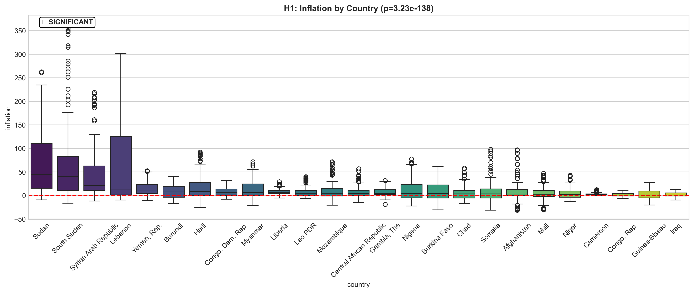
  <br><em>H1: Regional inflation distribution, showing significant differences across countries</em>
</p>

<p align="center">
  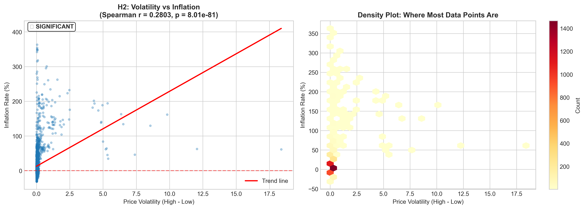
  <br><em>H2: Price volatility (High−Low range) vs inflation rate</em>
</p>

<p align="center">
  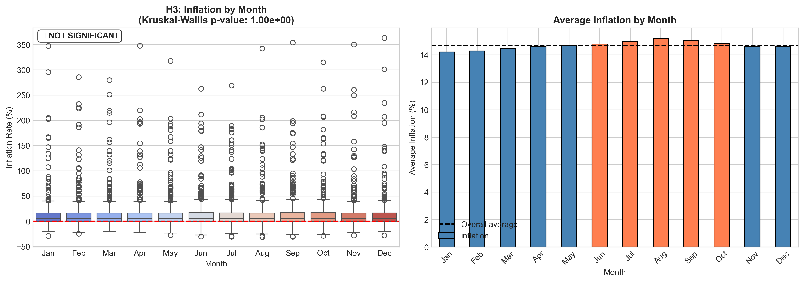
  <br><em>H3: Seasonal patterns in food price inflation</em>
</p>

<p align="center">
  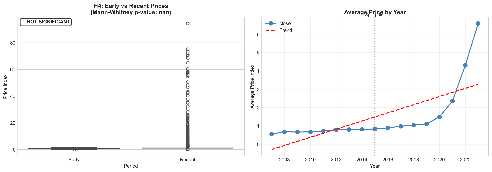
  <br><em>H4: Long-term upward trend in food prices (2007–2023)</em>
</p>

<p align="center">
  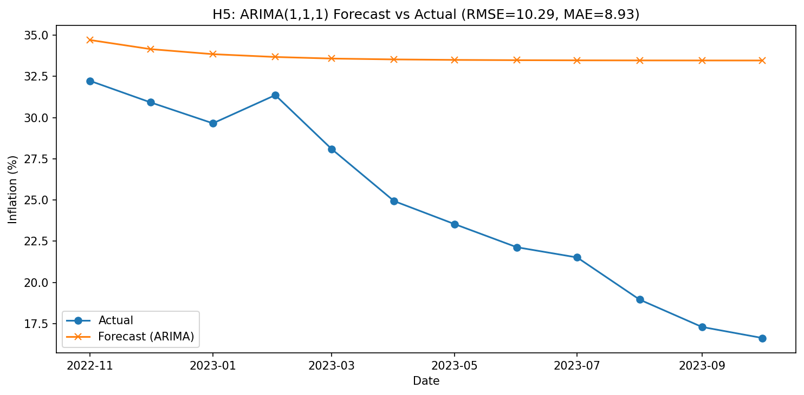
  <br><em>H5: ARIMA(1,1,1) forecast vs actual inflation on 12-month holdout</em>
</p>

### Key Insights

1. **Regional Disparities**: Food price inflation varies significantly across countries, indicating that local factors (supply chains, policies, climate) play a crucial role
2. **Volatility-Inflation Link**: Higher price volatility is associated with higher inflation rates, suggesting that price stabilisation policies could help control inflation
3. **Long-term Upward Trend**: Food prices have significantly increased from 2007 to 2023, raising concerns about food affordability globally
4. **Predictive Potential**: Machine learning models can forecast inflation trends with reasonable accuracy, enabling proactive policy responses
5. **ARIMA Forecasting**: The ARIMA(1,1,1) model captures time dependency and general trend direction, but forecasting accuracy is moderate due to structural volatility and post-2020 inflation shocks.

#### Machine Learning Visualisations

<p align="center">
  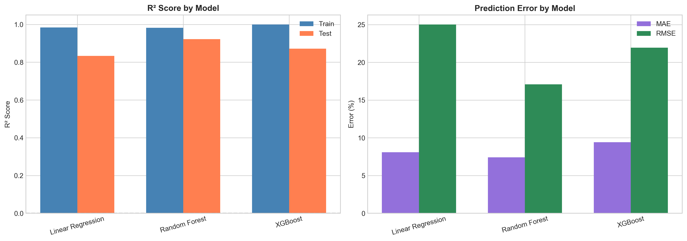
  <br><em>Model performance comparison: R² scores across candidate algorithms</em>
</p>

<p align="center">
  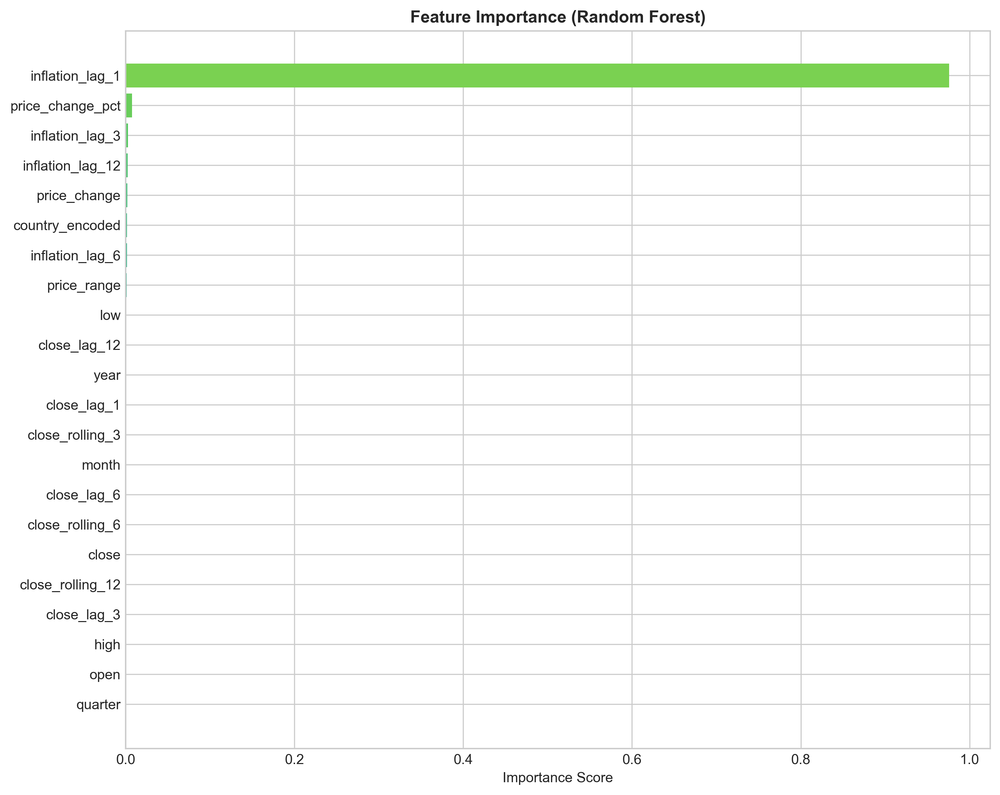
  <br><em>Feature importance from the best-performing model</em>
</p>

<p align="center">
  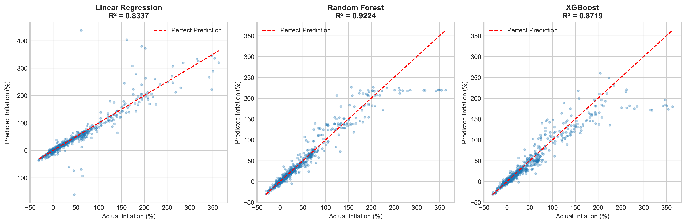
  <br><em>Actual vs predicted inflation: model validation</em>
</p>

---

## Ethical Considerations

### Data Privacy & Governance
- **Data Source**: Publicly available World Bank dataset
- **No PII**: Dataset contains aggregate economic indicators only
- **Transparency**: All data sources and transformations documented
- **Reproducibility**: Analysis can be fully reproduced from raw data

### GDPR & Data Protection Compliance
This project is fully compliant with the **General Data Protection Regulation (GDPR)** and broader data protection principles:

- **No personal data processed**: The dataset contains only aggregate, country-level economic indicators. No individual-level data, names, addresses, or other personally identifiable information (PII) is collected, stored, or processed at any stage of the pipeline.
- **Lawful basis**: All data is sourced from the World Bank's publicly available open data portal, released under a permissive licence for research and educational use.
- **Data minimisation**: Only the variables necessary for the analysis objectives are retained. No surplus data is collected or stored beyond what is required.
- **Storage & retention**: Raw and cleaned datasets are stored locally within the project repository. No data is transmitted to external servers beyond the Heroku deployment, which serves only the Streamlit dashboard (no database or user tracking).
- **No automated decision-making**: The machine learning predictions are provided for informational and educational purposes only. No automated decisions affecting individuals are made based on model outputs.
- **Right to transparency**: This README, the Jupyter notebooks, and the dashboard itself document every data transformation, statistical test, and modelling decision, ensuring full auditability.

### Data Ethics Management
- **Bias awareness**: Country-level aggregation may mask within-country inequalities. Findings should not be used to stereotype nations or populations.
- **Responsible communication**: Statistical results are presented with appropriate caveats, confidence levels, and limitations to prevent misinterpretation.
- **Vulnerable populations**: Food price inflation disproportionately affects low-income households. The analysis aims to inform policy interventions that support, rather than exploit, affected communities.
- **AI transparency**: AI-assisted development is documented in the notebooks. All AI-generated code was reviewed, tested, and validated by the team before inclusion.
- **Open access**: The project is open-source, enabling peer review, reproducibility, and community contribution.

### Legal Implications
- Data used under World Bank open data licence
- No commercial restrictions on analysis
- Findings presented objectively without political bias

### Social Considerations
- Food price data affects vulnerable populations
- Analysis aims to inform, not exploit
- Findings presented with appropriate context

---

## Installation & Setup

### Prerequisites
- Python 3.12+
- pip package manager
- Git

### Setup Instructions

1. **Clone the repository**
   ```bash
   git clone https://github.com/your-username/Food_price_inflation_analysis.git
   cd Food_price_inflation_analysis
   ```

2. **Create virtual environment**
   ```bash
   python -m venv .venv
   source .venv/bin/activate  # Linux/Mac
   .venv\Scripts\activate     # Windows
   ```

3. **Install dependencies**
   ```bash
   pip install -r requirements.txt
   ```

4. **Run Jupyter notebooks**
   ```bash
   jupyter notebook
   ```

---

## Technologies Used

| Technology | Purpose |
|-----------|---------|
| Python 3.12 | Primary programming language |
| Pandas | Data manipulation and analysis |
| NumPy | Numerical computations |
| Plotly | Interactive charts in the Streamlit app |
| Matplotlib / Seaborn | Static charts in Jupyter notebooks |
| Streamlit 1.40 | 8-page interactive web dashboard |
| Power BI Desktop | Business-facing interactive report (.pbix) |
| SciPy | Statistical hypothesis testing (H1–H5) |
| Scikit-learn | Machine learning pipeline & preprocessing |
| XGBoost | Best-performing inflation prediction model |
| Joblib | Model serialisation & loading |
| Jupyter Notebook | Data exploration and experimentation |
| Git / GitHub | Version control & team collaboration |

---

## Future Improvements

1. **Enhanced Predictive Models**: Incorporate ARIMA/SARIMA for better time series forecasting
2. **Additional Data Sources**: Integrate macroeconomic indicators (GDP, exchange rates, oil prices)
3. **Real-time Updates**: Automate data refresh pipeline with scheduled API calls
4. **API Development**: Create REST API endpoints for data access
5. **Extended Geographic Coverage**: Include more countries and regional breakdowns
6. **Deep Learning Models**: Implement LSTM networks for sequential pattern recognition
7. **Anomaly Detection**: Add alerts for unusual price movements

---

## Credits & References

### Data Sources
- [World Bank - Real-Time Food Prices](https://www.worldbank.org/en/programs/food-prices-for-nutrition)

### Code Attribution
- Code Institute template and guidance
- AI-assisted development (documented in notebooks)

### Acknowledgements
- Code Institute for the project template
- World Bank for the open data

---

## Deployment

### Heroku Deployment

1. Log in to Heroku and create an App
2. At the **Deploy** tab, select **GitHub** as the deployment method
3. Select your repository name and click **Connect**
4. Select the branch you want to deploy, then click **Deploy Branch**
5. Click **Open App** to access your application

---

## Live Dashboards

### 🖥️ Streamlit Web App
Run locally or access the deployed version:
- **Local**: `streamlit run app.py` (after setup steps above)
- **Deployed**: [Link to deployed app on Heroku]

### 📊 Power BI Report
Open the `.pbix` file in Power BI Desktop to explore the interactive business dashboard:
- **File**: `Power Bi/Food Price Inflation Analysis.pbix`
- **Requirements**: [Power BI Desktop](https://powerbi.microsoft.com/desktop/) (free download)

---

## Contact

For questions or collaboration opportunities, please reach out through GitHub issues.

**Team**: Sergio, Gia & Florence  
**Hackathon**: Code Institute Data Analytics

---

*Last Updated: March 2026*
